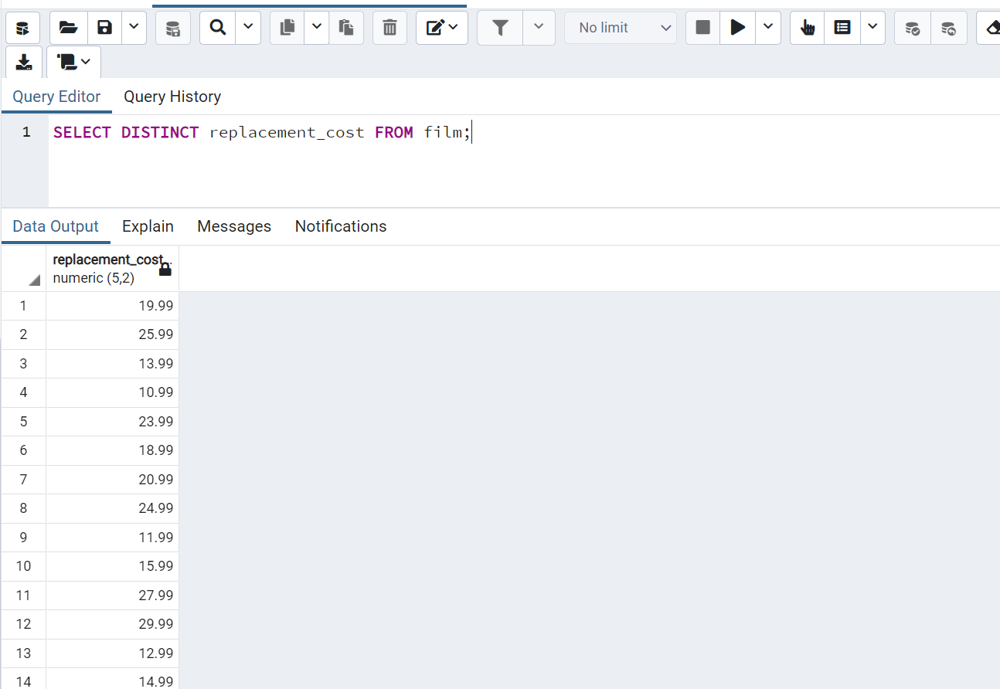

# patika.dev - SQL ÖDEVİ 4

1- film tablosunda bulunan replacement_cost sütununda bulunan birbirinden farklı değerleri sıralayınız.

```SQL
SELECT DISTINCT replacement_cost FROM film;
```



<br />

2- film tablosunda bulunan replacement_cost sütununda birbirinden farklı kaç tane veri vardır?

```SQL
SELECT COUNT(DISTINCT replacement_cost) FROM film;

Sonuç: 21
```


<br/>


3-film tablosunda bulunan film isimlerinde (title) kaç tanesini T karakteri ile başlar ve aynı zamanda rating 'G' ye eşittir?


```SQL
SELECT COUNT(*) FROM film 
WHERE title LIKE 'T%' AND rating = 'G';

Sonuç: 9
```


<br />

4- country tablosunda bulunan ülke isimlerinden (country) kaç tanesi 5 karakterden oluşmaktadır?

```SQL
SELECT COUNT(*) FROM country WHERE country LIKE '_____';

Sonuç: 5
```


<br />

5- city tablosundaki şehir isimlerinin kaç tanesi 'R' veya r karakteri ile biter?

```SQL
SELECT Count(*) FROM city WHERE city ILIKE '%R';
```


---

