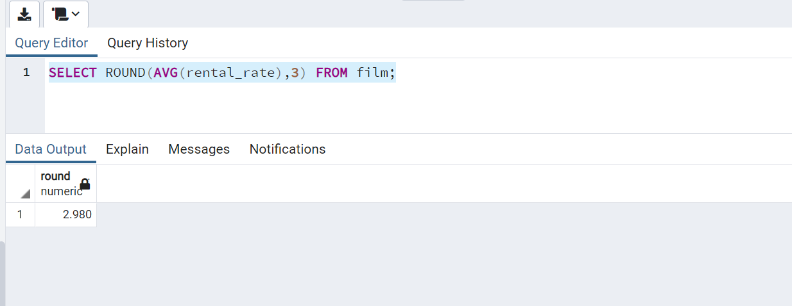
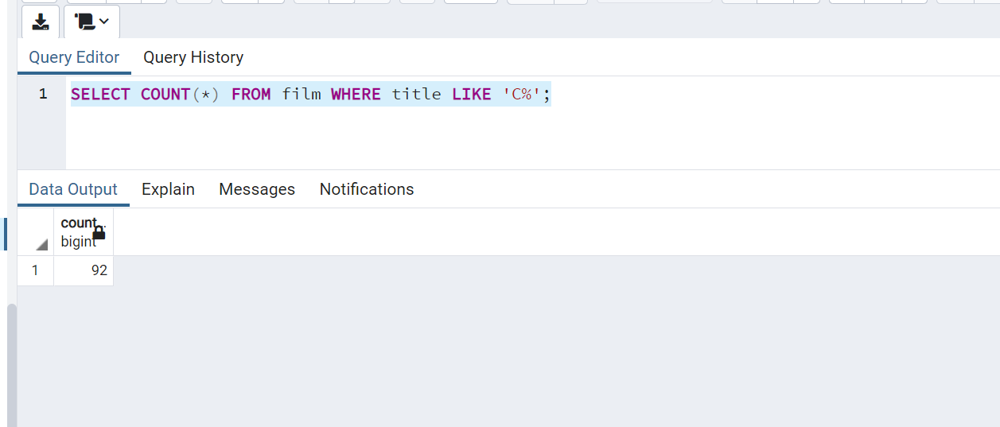
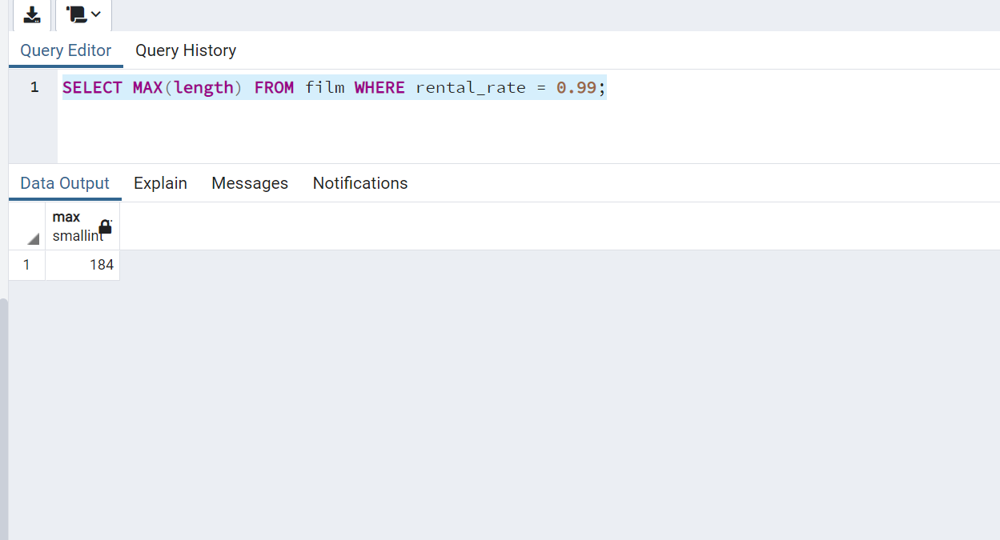
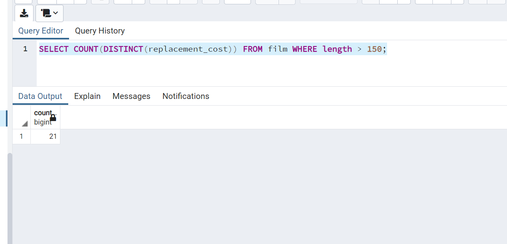

# patika.dev - SQL ÖDEVİ 6


1- film tablosunda bulunan rental_rate sütunundaki değerlerin ortalaması nedir?


```SQL
SELECT ROUND(AVG(rental_rate),3) FROM film;
```



2- film tablosunda bulunan filmlerden kaç tanesi 'C' karakteri ile başlar?

```SQL
SELECT COUNT(*) FROM film WHERE title LIKE 'C%';
```



3- film tablosunda bulunan filmlerden rental_rate değeri 0.99 a eşit olan en uzun (length) film kaç dakikadır?

```SQL
SELECT MAX(length) FROM film WHERE rental_rate = 0.99;

Sonuç: 184
```



4- film tablosunda bulunan filmlerin uzunluğu 150 dakikadan büyük olanlarına ait kaç farklı replacement_cost değeri vardır?

```SQL
SELECT COUNT(DISTINCT(replacement_cost)) FROM film WHERE length > 150;
```



---