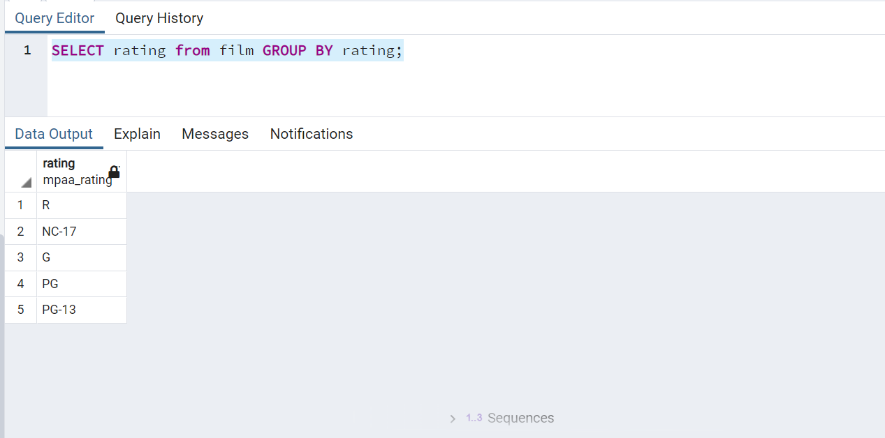
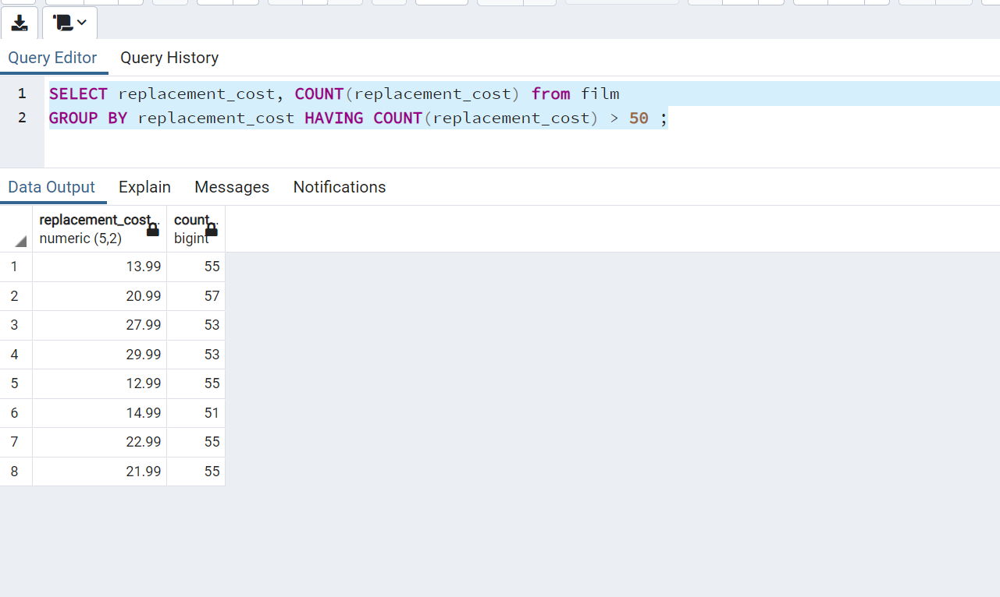
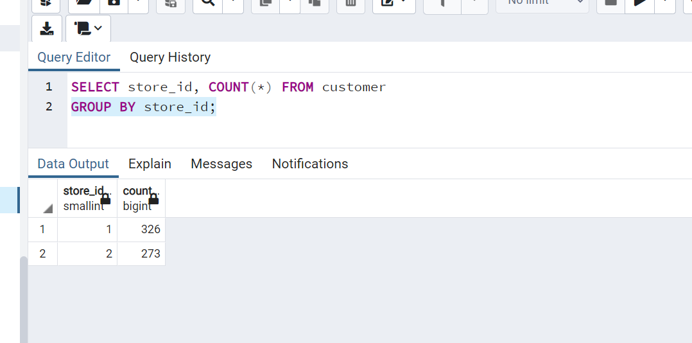
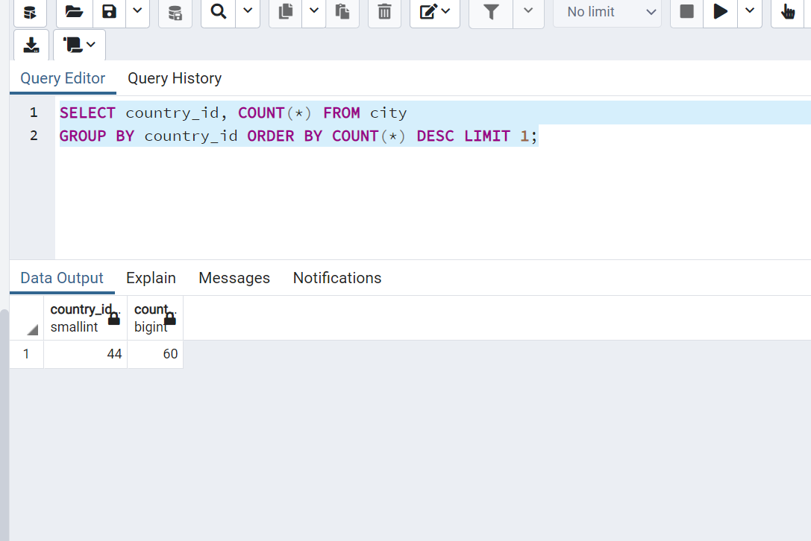

# patika.dev - SQL ÖDEVİ 7

1- film tablosunda bulunan filmleri rating değerlerine göre gruplayınız.

```SQL
SELECT rating from film GROUP BY rating;
```



2- film tablosunda bulunan filmleri replacement_cost sütununa göre grupladığımızda film sayısı 50 den fazla olan replacement_cost değerini ve karşılık gelen film sayısını sıralayınız.

```SQL
SELECT replacement_cost, COUNT(replacement_cost) 
FROM film 
GROUP BY replacement_cost 
HAVING COUNT(replacement_cost) > 50 ;
```



3- customer tablosunda bulunan store_id değerlerine karşılık gelen müşteri sayılarını nelerdir? 

```SQL
SELECT store_id, COUNT(*) FROM customer
GROUP BY store_id;
```




4- city tablosunda bulunan şehir verilerini country_id sütununa göre gruplandırdıktan sonra en fazla şehir sayısı barındıran country_id bilgisini ve şehir sayısını paylaşınız.

```SQL
SELECT country_id, COUNT(*) FROM city
GROUP BY country_id ORDER BY COUNT(*) DESC LIMIT 1;
```



---

