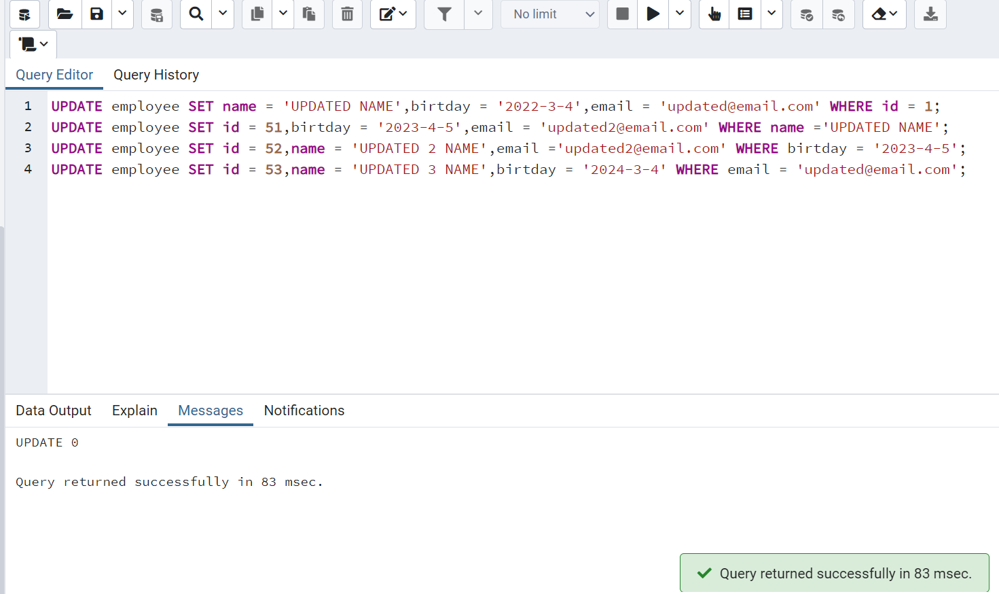

# patika.dev - SQL Ödevi 8
 

1- test veritabanınızda employee isimli sütun bilgileri id(INTEGER), name VARCHAR(50), birthday DATE, email VARCHAR(100) olan bir tablo oluşturalım.

```SQL
CREATE TABLE employee (
	id INTEGER PRIMARY KEY,
	name VARCHAR(50) NOT NULL,
	birtday DATE,
	email VARCHAR(100)
);
```


2- Oluşturduğumuz employee tablosuna 'Mockaroo' servisini kullanarak 50 adet veri ekleyelim.
 


3- Sütunların her birine göre diğer sütunları güncelleyecek 5 adet UPDATE işlemi yapalım.


```SQL
UPDATE employee SET name = 'UPDATED NAME',birtday = '2022-3-4',email = 'updated@email.com' WHERE id = 1;

UPDATE employee SET id = 51,birtday = '2023-4-5',email = 'updated2@email.com' WHERE name ='UPDATED NAME';

UPDATE employee SET id = 52,name = 'UPDATED 2 NAME',email ='updated2@email.com' WHERE birtday = '2023-4-5';

UPDATE employee SET id = 53,name = 'UPDATED 3 NAME',birtday = '2024-3-4' WHERE email = 'updated@email.com';
```



4- Sütunların her birine göre ilgili satırı silecek 5 adet DELETE işlemi yapalım.

```SQL 
DELETE FROM employee WHERE id = 5;
DELETE FROM employee WHERE name = 'UPDATED NAME';
DELETE FROM employee WHERE birtday = '2024-4-5';
DELETE FROM employee WHERE email = 'updated2@email.com';
```


---